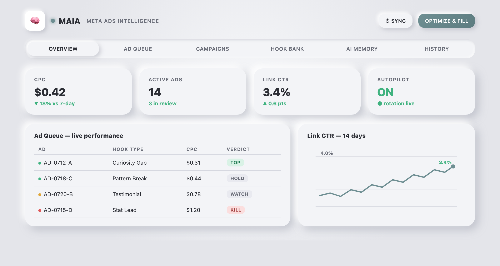
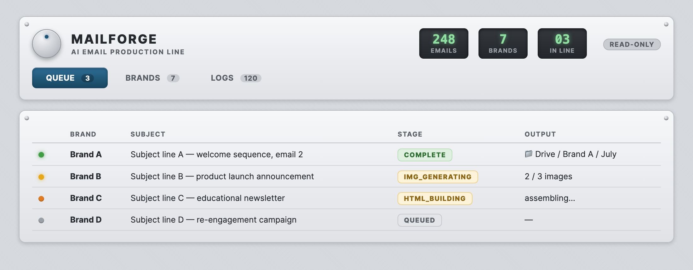
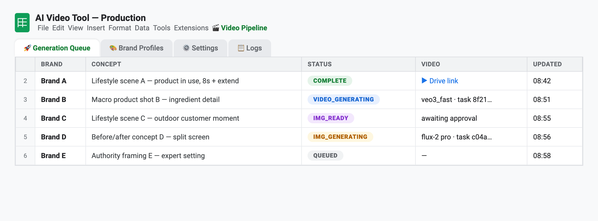
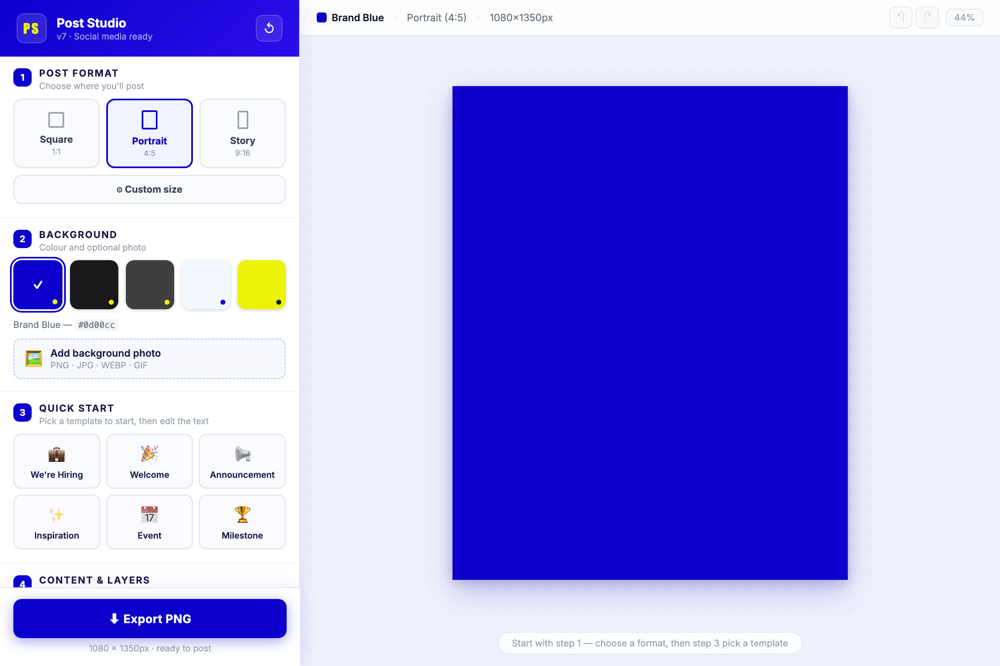

# The AI Toolbox

**Ieva + Claude Code. Ten weeks, seven production tools, ~23,000 lines, zero engineering hires.**

Every tool runs the same architecture: a Google Sheet as the interface, Apps Script as the engine, Claude + AI image/video generation as the creative department.

## MAIA — Ads That Manage Themselves

Researches real buyers, writes hooks, generates images and video, publishes to Meta — then pauses losers, breeds winners, and turns every rejection into a rule. Built in ~6 weeks (~16,400 lines). Live and autonomous, steering on low CPC and high link CTR.

<video controls preload="metadata" width="100%" style="border-radius:8px;">
  <source src="assets/maia-intro.mp4" type="video/mp4">
  Your browser does not support embedded video — <a href="assets/maia-intro.mp4">download the MAIA intro</a>.
</video>

## MailForge — Half a Day of Design Work, Now a Queue Row

A copy brief in a sheet row comes back as a finished, on-brand HTML email in Drive. Built in ~2 weeks (~3,700 lines); in production for every brand. Saves 3–4 design hours per email.

<video controls preload="metadata" width="100%" style="border-radius:8px;">
  <source src="assets/mailforge-intro.mp4" type="video/mp4">
  Your browser does not support embedded video — <a href="assets/mailforge-intro.mp4">download the MailForge intro</a>.
</video>

## Video Tool — Stills That Learned to Move

Claude designs a frame, checks it with vision, and Veo 3.1 animates it. Built in ~2 weeks (~1,700 lines); replaces $100–500 stock clips with a few dollars of rendering.

## SOT — The Quiet Multiplier

Auto-syncs brand docs into AI-ready brandbooks that every other tool consumes. Built in ~1 week (~780 lines); makes onboarding a new brand a minutes-long task.

## The Fast Ones

**Figma Price Sync** — one-click catalog price tagging, 37/37 verified. **Social Generator** — the May proof-of-concept that started it all, now at v7. Plus a shared safety harness (caps, kill switches) and a Vercel render service behind the scenes.

## The Scoreboard

| Tool | Built in | Status | Value (est.) |
|---|---|---|---|
| MAIA | ~6 weeks | Live, autonomous | $2,000–6,000/mo creative replaced |
| MailForge | ~2 weeks | Production | 3–4 hrs saved per email |
| Video Tool | ~2 weeks | Operational | $100–500 per clip |
| SOT | ~1 week | Feeds all tools | Cross-tool multiplier |
| Price Sync | Days | Verified | Hours per catalog |
| Social Generator | Days | In use | Proof of concept |

## Why Each One Got Cheaper

Every build left reusable parts — the pipeline pattern, brand profiles, safety harness, deploy scripts. The first flagship took six weeks; an equivalent tool today takes days.

---

*Values are replacement-cost estimates. Measured KPIs — cost per click and link CTR — are tracked daily in MAIA's History tab. Interface images and videos are brand-neutral renders built from each tool's actual UI code.*
